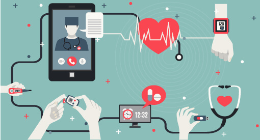
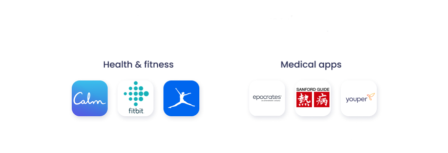
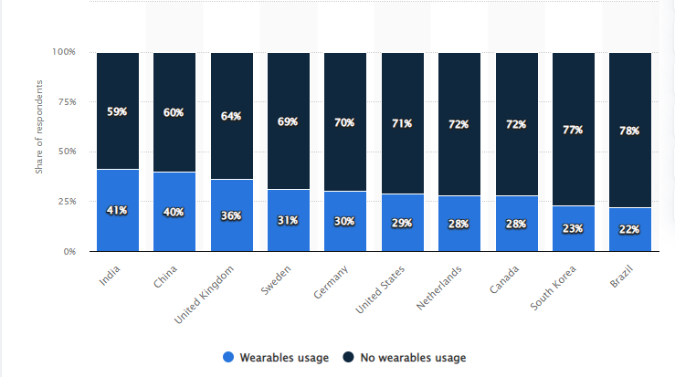

# mHealth
---
### What is mHeath?
> “We believe consumer health technologies — apps, wearables, self-diagnosis tools — have the potential to strengthen the patient-physician connection and improve health outcomes.”  
> ***~Dr. Glen Stream, Chairman, Family Medicine for America’s Health***

  
*mHealth in action*  
Robert Istepanian introduced the term “mHealth” to refer to the use of "developing mobile communications and network technologies for healthcare." Mobile health (mHealth) refers to the use of mobile phones and other wireless technologies in medical care. mHealth, or mobile health, is a fast expanding discipline that employs mobile technology to enhance healthcare outcomes. mHealth encompasses numerous uses, such as telemedicine, remote patient monitoring, and health education. The rising availability of smartphones and other mobile devices, coupled with developments in wireless technology, has enabled healthcare providers to give patients with in novel and inventive ways. 
 
### mHealth Tools and Technologies

mHealth technologies and tools refer to the use of mobile devices and digital technology to assist and enhance health and healthcare. This includes telemedicine, mobile health apps, wearable gadgets, and remote monitoring systems. These tools and technologies offer numerous benefits in healthcare, including enhanced access to information and services, more patient engagement, and improved disease management and prevention.

<iframe width="560" height="315" src="https://www.youtube.com/embed/ItNZILObXhA" title="YouTube video player" frameborder="0" allow="accelerometer; autoplay; clipboard-write; encrypted-media; gyroscope; picture-in-picture; web-share" allowfullscreen></iframe> 
 
**1. Telemedicine:**
Telemedicine is the electronic transmission of medical information from one location to another, which improves patient health condition. Telemedicine has numerous uses and can be utilized for a variety of services, such as wireless tools, email, two-way video, cellphones, and other forms of telecommunications technology. 

  
*Illustration of Telemedicine*  
**2.	Mobile health (mHealth) apps:**
The prevalence of mHealth and telehealth applications for consumers and healthcare providers continues to rise.
 
*Google Play Store’s most popular health software*  
Recent research indicates that Google Play hosts approximately 47 thousand healthcare applications of various types. This number is going up by 1.5% every three months, which shows how much more people are interested in mobile health. 

<iframe width="560" height="315" src="https://www.youtube.com/embed/OZT0TocN-hE" title="YouTube video player" frameborder="0" allow="accelerometer; autoplay; clipboard-write; encrypted-media; gyroscope; picture-in-picture; web-share" allowfullscreen></iframe> 
 
**3. Wearable devices:**
Wearables have significant potential for health research and data collection. They can collect data for a more accurate clinical diagnosis and enable remote patient monitoring. Wearables have found considerable use in the following disciplines in recent years::

 •	COVID-19 forecasts 
•	Fertility monitoring 
•	Heat-related disorders 
•	Drug effects 
•	Behavioral interventions 

 
*Wearable devices usage in various countries in 2022*  

Thus, wearable healthcare technology has several benefits for the individual and the public. As this technology gains popularity, manufacturers are racing to create wearables for specific health conditions. Wearables are already part of daily life, and some have wide commercial applications.
 

**4. Electronic health records (EHRs):**
EHRs are digitized copies of patient charts. Authorized users can access real-time, patient-centered EHRs securely. EHRs store patients' medical and treatment records, but they can also include a more comprehensive view of their care. 

  

### Advantages of mHealth

The most common application of mHealth is the use of mobile devices to educate customers about preventative healthcare services. mHealth is also used to keep an eye on diseases, help with therapy, track the spread of epidemics, and take care of people with long-term illnesses.
 The following are the advantages of mobile health technology,

**- Allows people to get in touch with doctors and receive treatment more quickly.** 
Mobile health technologies allow patients to send secure messages, arrange appointments, and connect to providers 24/7 for telemedicine visits. Telemedicine is one of the fastest-growing ways patients use mobile health apps. They like that they can visit a doctor on their phone or tablet without leaving work or traveling. Most health systems are delivering network and contracted telehealth physician telemedicine consultations after hours and on weekends to meet demand. 

**- Enables and simplifies remote patient monitoring** 
Remote patient monitoring is a subgenre of home care and telehealth that allows patients to use mobile devices and mobile health technology to collect, enter, or automatically transmit health data to healthcare providers. Remote patient monitoring is most typically used to help patients manage chronic conditions or ensure they follow hospital discharge guidelines and take their prescriptions. Data broadcast from mobile devices includes:  
 1. Weight, blood pressure, and heart rate monitors 
2. Glucose meters 
3. Diet data trackers 

**- Advantage for the pharmaceutical sector** 
It is important to understand that the pharmaceutical industry must engage in continuous research and provide evidence of the efficacy of its drugs. Through the use of medication and mHealth, it is possible to analyze the evolution of the disease with better precision. So, once the drug has been tested and approved, these apps can be used to keep an eye on health.

**- Reduced chances of misdiagnosis** 
When clinicians manually manage patient records, they are susceptible to diagnostic errors. Without mHealth software, it is simple to omit data, confuse patient histories, or lose vital documents. Such mistakes may lead to a misdiagnosis. Each year, 12 million people in the United States are affected by diagnostic errors. As a result of the complications, between 40,000 and 80,000 of them die. Due to the fact that mHealth software records all communications, prescriptions, and treatment alternatives, it reduces the likelihood of diagnostic errors. Providers of healthcare services can provide patients with data-driven care while also protecting themselves against malpractice claims.
