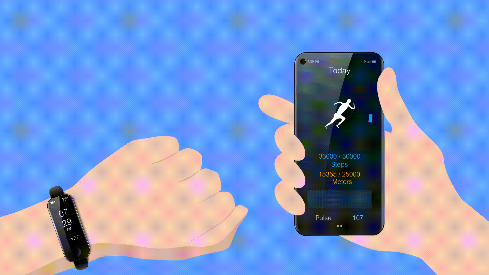

# mHealth
---
### What is mHeath?
---
> “We believe consumer health technologies — apps, wearables, self-diagnosis tools — have the potential to strengthen the patient-physician connection and improve health outcomes.”  
> ***~Dr. Glen Stream, Chairman, Family Medicine for America’s Health***

  
*mHealth in action*  
Robert Istepanian introduced the term “mHealth” to refer to the use of "developing mobile communications and network technologies for healthcare." Mobile health, often known as mHealth, is the practice of using mobile phones and other wireless technology into medical treatment. mHealth, or mobile health, is a fast expanding discipline that employs mobile technology to enhance healthcare outcomes. mHealth encompasses numerous uses, such as telemedicine, remote patient monitoring, and health education. The rising availability of smartphones and other mobile devices, coupled with developments in wireless technology, has enabled healthcare providers to give patients care in novel and inventive ways. 
 
### mHealth Tools and Technologies
---

mHealth technologies and tools refer to the use of mobile devices and digital technology to assist and enhance health and healthcare. This includes telemedicine, mobile health apps, wearable gadgets, and remote monitoring systems. These tools and technologies offer numerous benefits in healthcare, including enhanced access to information and services, more patient engagement, and improved disease management and prevention.

<iframe width="560" height="315" src="https://www.youtube.com/embed/ItNZILObXhA" title="YouTube video player" frameborder="0" allow="accelerometer; autoplay; clipboard-write; encrypted-media; gyroscope; picture-in-picture; web-share" allowfullscreen></iframe> 
 
**1. Telemedicine:**
Telemedicine is the electronic transmission of medical information from one location to another, which improves patient health conditions. Telemedicine has numerous uses and can be utilized for a variety of services, such as wireless tools, email, two-way video, cellphones, and other forms of telecommunications technology. 

  
*Illustration of Telemedicine*  
**2.	Mobile health (mHealth) apps:**
The prevalence of mHealth and telehealth applications for consumers and healthcare providers continues to rise.
 
*Google Play Store’s most popular health software*  
Recent research indicates that Google Play hosts approximately 47 thousand healthcare applications of various types. This number is going up by 1.5% every three months, which shows how much more people are interested in mobile health. 

<iframe width="560" height="315" src="https://www.youtube.com/embed/OZT0TocN-hE" title="YouTube video player" frameborder="0" allow="accelerometer; autoplay; clipboard-write; encrypted-media; gyroscope; picture-in-picture; web-share" allowfullscreen></iframe> 
 
**3. Wearable devices:**
Wearables have significant potential for health research and data collection. They can collect data for a more accurate clinical diagnosis and enable remote patient monitoring. Wearables have found considerable use in the following disciplines in recent years:

 •	COVID-19 forecasts 
•	Fertility monitoring 
•	Heat-related disorders 
•	Drug effects 
•	Behavioral interventions 

 
*Wearable devices usage in various countries in 2022*  

Thus, wearable healthcare technology has several benefits for the individual and the public. As this technology gains popularity, manufacturers are racing to create wearables for specific health conditions. Wearables are already part of daily life, and some have wide commercial applications.
 

**4. Electronic health records (EHRs):**
EHRs are digitized copies of patient charts. Authorized users can access real-time, patient-centered EHRs securely. EHRs store patients' medical and treatment records, but they can also include a more comprehensive view of their care. 

  

### Advantages of mHealth
---

The utilization of mobile devices for the purpose of educating clients about preventive healthcare services is the most popular application of mHealth. mHealth is also used to keep an eye on diseases, help with therapy, track the spread of epidemics, and take care of people with long-term illnesses.
 The following are the advantages of mobile health technology:

- **Allows people to get in touch with doctors and receive treatment more quickly.** 

Mobile health technologies allow patients to send secure messages, arrange appointments, and connect to providers 24/7 for telemedicine visits. Telemedicine is one of the fastest-growing ways patients use mobile health apps. They like that they can visit a doctor on their phone or tablet without leaving work or traveling. Most health systems are delivering network and contracted telehealth physician telemedicine consultations after hours and on weekends to meet demand. 

- **Enables and simplifies remote patient monitoring** 

Remote patient monitoring is a subgenre of home care and telehealth that allows patients to use mobile devices and mobile health technology to collect, enter, or automatically transmit health data to healthcare providers. Remote patient monitoring is most typically used to help patients manage chronic conditions or ensure they follow hospital discharge guidelines and take their prescriptions. Data broadcast from mobile devices includes:  
1. Weight, blood pressure, and heart rate monitors 
2. Glucose meters 
3. Diet data trackers 

- **Advantages for the pharmaceutical sector** 

It is essential to have an understanding that the pharmaceutical sector is required to participate in ongoing research and present proof of the effectiveness of the medications that it produces. Through the use of medication and mHealth, it is possible to analyze the evolution of the disease with better precision. So, once the drug has been tested and approved, these apps can be used to keep an eye on health.

- **Reduced chances of misdiagnosis** 

When clinicians manually manage patient records, they are susceptible to diagnostic errors. Without mHealth software, it is simple to omit data, confuse patient histories, or lose vital documents. Such mistakes may lead to a misdiagnosis. Each year, 12 million people in the United States are affected by diagnostic errors. As a result of the complications, between 40,000 and 80,000 of them die. Due to the fact that mHealth software records all communications, prescriptions, and treatment alternatives, it reduces the likelihood of diagnostic errors. Providers of healthcare services can provide patients with data-driven care while also protecting themselves against malpractice claims. 
 
### The future of mHealth and its potential to revolutionize the healthcare system
---

Although it's simple for mobile healthcare organizations to think about the future, it's already here. The healthcare organizations that act today will prosper in the future. Mobile healthcare is here to stay. In reality, as time passes, it simply spreads more widely. Many patients engaged with telemedicine and mHealth applications for the first time in 2020 as a consequence of COVID-19's urgent need to treat patients using novel, inventive methods. The consumerization of healthcare, the development of mHealth technology, and the efficiency quotient cannot be disregarded as we go ahead.

<iframe width="560" height="315" src="https://www.youtube.com/embed/9Hi8jm80uJI" title="YouTube video player" frameborder="0" allow="accelerometer; autoplay; clipboard-write; encrypted-media; gyroscope; picture-in-picture; web-share" allowfullscreen></iframe> 

Healthcare now differs from healthcare in earlier decades, centuries, and even earlier years. The futuristic, intelligent mobile healthcare companies are already making changes to keep up with the trends, and both their patients and the organizations are greatly benefiting.  

### The barriers to widespread adoption of mHealth
---

There is a lot of promise in mHealth, but also a lot of difficulty in putting it into practice because of all the obstacles. The following is a list of some of the most often mentioned obstacles to the widespread adoption of mHealth:

•	Concerns about confidentiality and safety as an ethical issue 
• Not enough medical and technological resources 
•	Need for trained workers to operate cutting-edge equipment 
•	Inducing anxiety and interfering with the doctor-patient connection 
• Difficulty in understanding and using the software 
• It might take some time to update EHRs 
• Remote places' lack of access to fundamental infrastructure, such as an internet connection 
•	Accessible information is beyond the comprehension of the average person 
•	Increased monetary barrier to entry for internet access due to rising prices 

### Final Thoughts
---

  

mHealth has the potential to significantly enhance healthcare outcomes by expanding access to treatment, strengthening patient monitoring, and upgrading health education. Nonetheless, there are obstacles to be overcome, such as a lack of standards and data security. With more research and development, mHealth could change the way healthcare is given in a big way.

### Reference
---

1. Solomon Nsor-Anabiah, Ugonna Udunwa, Dr. Sathish Malathi, January 2019, ***Review of the Prospects and Challenges of mHealth Implementation in Developing Countries***
[https://www.researchgate.net/publication/358348915_Review_of_the_Prospects_and_Challenges_of_mHealth_Implementation_in_Developing_Countrie](https://www.researchgate.net/publication/358348915_Review_of_the_Prospects_and_Challenges_of_mHealth_Implementation_in_Developing_Countries)  

2. WHO Global Observatory for eHealth, 2011, ***mHealth: new horizons for health through mobile technologies: second global survey on eHealth, World Health Organization***  
[https://apps.who.int/iris/handle/10665/44607](https://apps.who.int/iris/handle/10665/44607)  

3. S. Michael Ross, September 12, 2019, ***What Are the Benefits of Mobile Health Technology***  
[https://blog.cureatr.com/benefits-of-mobile-health-technology](https://blog.cureatr.com/benefits-of-mobile-health-technology)  

4. L. Ceci, November 8, 2022, ***Number of mHealth apps available in the Google Play Store from 1st quarter 2015 to 3rd quarter 2022***  [https://www.statista.com/statistics/779919/health-apps-available-google-play-worldwide/](https://www.statista.com/statistics/779919/health-apps-available-google-play-worldwide/)  

5. Steven Tucker, March 10, 2015, ***Welcome to the world of mHealth!***  [https://www.ncbi.nlm.nih.gov/pmc/articles/PMC5344173/#:~:text=The%20term%20mHealth%20was%20first,for%20healthcare%E2%80%9D%20(1).](https://www.ncbi.nlm.nih.gov/pmc/articles/PMC5344173/#:~:text=The%20term%20mHealth%20was%20first,for%20healthcare%E2%80%9D%20(1).)  

6. Alexander Kunst, June 1, 2022, ***Do you personally use wearables (e.g. smart watch, health / fitness tracker)?***  [https://www.statista.com/forecasts/1101110/wearables-devices-usage-in-selected-countries](https://www.statista.com/forecasts/1101110/wearables-devices-usage-in-selected-countries)  

7. Kumar Laxman, Sharanie Banu Krishnan, Jaspaljeet Singh Dhillon, 2015, ***Barriers to Adoption of Consumer Health Informatics Applications for Health Self Management***  [https://www.itmedicalteam.pl/articles/barriers-to-adoption-of-consumer-health-informatics-applications-for-health-self-management.pdf](https://www.itmedicalteam.pl/articles/barriers-to-adoption-of-consumer-health-informatics-applications-for-health-self-management.pdf)  

8. ***mHealth***  [https://en.wikipedia.org/wiki/MHealth](https://en.wikipedia.org/wiki/MHealth)  

9. Tayla Holman, ***mHealth (mobile health)***  [https://www.techtarget.com/searchhealthit/definition/mHealth](https://www.techtarget.com/searchhealthit/definition/mHealth)  
